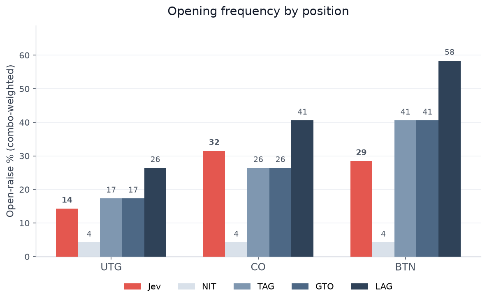
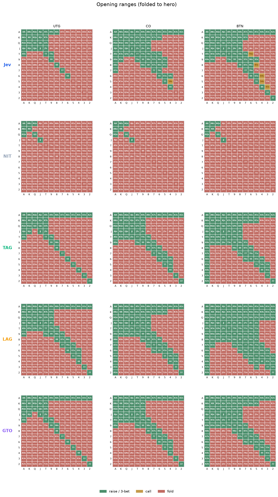

# Is Jev a decent preflop poker player?

**Yes, roughly.** Jev, a "System One" decision model from
[TypeSafe](https://typesafe.ai), trained for calibrated structured decisions
rather than text generation, plays a coherent, roughly tight-aggressive
6-max preflop game. Its opening decisions agree with a solid TAG/GTO
reference on **90.8%** of hands, it is **98.4% deterministic**, and its
confidence is well calibrated. Its one clear structural flaw: it does not
properly widen on the button.



## Result at a glance

Open-raise frequency by position (combo-weighted over the 1326-combo deck):

| Player | UTG | CO | BTN |
|---|---:|---:|---:|
| **Jev** | **14.3%** | **31.5%** | **28.5%** |
| NIT | 4.2% | 4.2% | 4.2% |
| TAG | 17.3% | 26.4% | 40.6% |
| GTO | 17.3% | 26.4% | 40.6% |
| LAG | 26.4% | 40.6% | 58.4% |

Every reference player widens sharply from cutoff to button. Jev instead
opens *less* from the button (28.5%) than from the cutoff (31.5%), so its
position sense flattens exactly where a good player monetizes it. Facing a
UTG raise, it is also 3-bet-heavy and call-light.



## What this is

A reproducible behavioral benchmark: does a decision model with no
documented poker training play preflop like a decent player, and can we tell
from its behavior alone? We reduce 845 preflop spots to a single
fold / call / raise decision, query Jev 5 times each (4,225 calls, model
pinned to `jev-1.13.0`), and compare against four deterministic reference
players (NIT / TAG / LAG / GTO) encoded as code (no LLM, no cost).

The full question, method, all six result tables, and the limitations are in
**[STUDY.md](STUDY.md)**.

## Terms

- **NIT / TAG / LAG**: playing styles from tightest to loosest. NIT is ultra-conservative, TAG is tight-aggressive (the standard solid style), LAG is loose-aggressive.
- **GTO** (game-theory-optimal): a solver-balanced, unexploitable strategy (the "perfect play" reference).
- **UTG / CO / BTN / BB**: table positions from worst (under the gun, first to act) to best (button, last to act); BB is the big blind.
- **Combo-weighted**: pairs/suited/offsuit hands occur 6/4/12 ways out of 1,326; every percentage weights by that.
- **3-bet**: a re-raise over an opening raise.

A fuller glossary is in [STUDY.md](STUDY.md#terminology).

## Reproduce

The raw data is committed (`data/battery.jsonl`), so results can be
regenerated without any API key:

```bash
pip install -r requirements.txt
python report.py     # tables -> out/*.csv, out/*.md
python charts.py     # charts -> out/*.png
```

To re-run the model queries from scratch (~52 minutes), set your TypeSafe key
and run:

```bash
export TYPESAFE_API_KEY=your_key
python battery.py
```

## Files

- `poker.py`: 169 hand classes, range parser, deterministic baseline players
- `battery.py`: runs the 4,225 API calls (model pinned to `jev-1.13.0`)
- `report.py`: metrics and CSV/Markdown tables
- `charts.py`: publication PNG charts
- `data/battery.jsonl`: every raw response (choice, probabilities, confidence)
- `out/`: tables and charts
- `STUDY.md`: the full write-up

## Notes

The NIT/TAG/LAG/GTO ranges are hand-encoded approximations of standard
6-max 100bb play and should be reviewed by a poker expert before any formal
publication. They are robust to the conclusion, but not to the last boundary
hand.

License: MIT. Free to use, modify, and redistribute with attribution;
provided without warranty. See [LICENSE](LICENSE).
